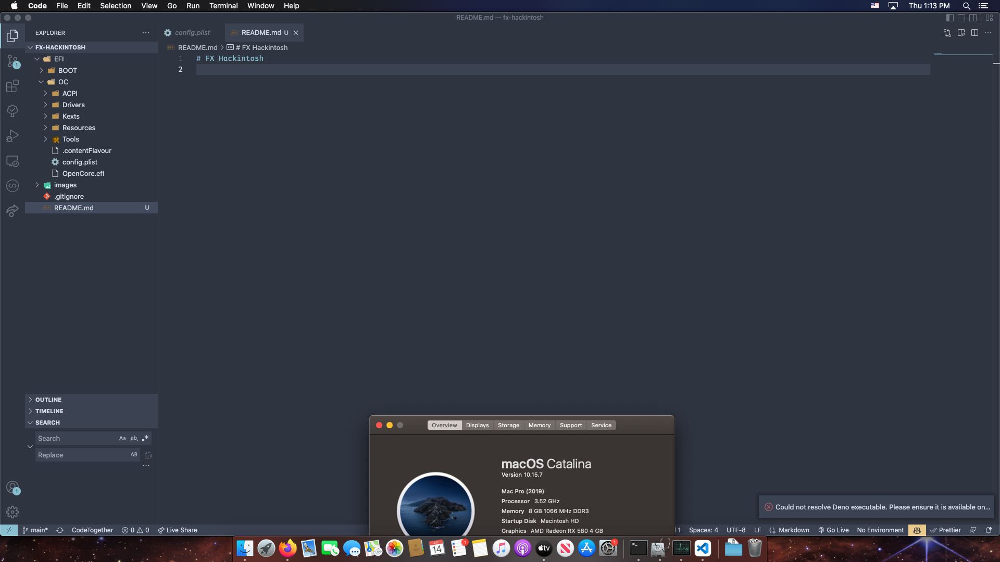

# FX Hackintosh

## Specs
CPU: AMD FX-8320 4-core CPU
GPU: MSI ARMOR RX 580 4gb
RAM: 2x (4x soon) 4gb DDR3 Sticks
Motherboard: GIGABYTE 970a-ds3p
## Notes
SMBIOS used is MacPro7,1. Generate your own serial number.